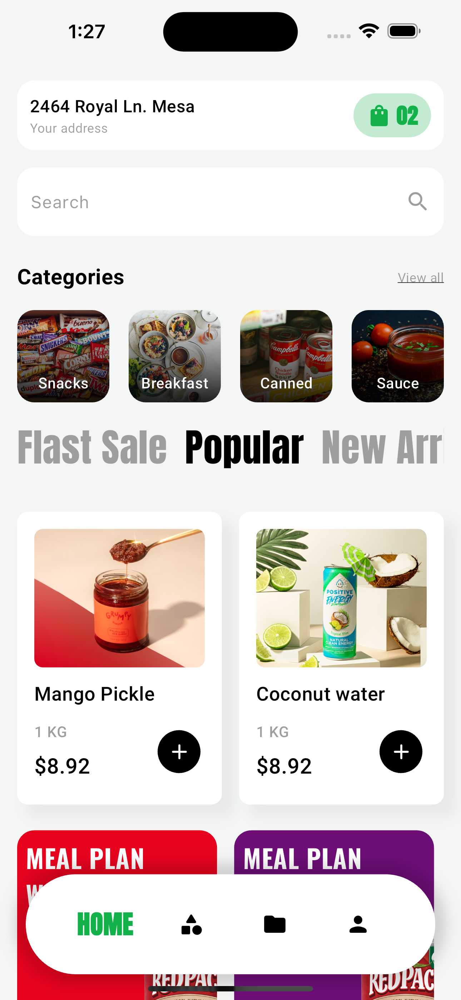

# Flutter UI 4

[](https://flutter.dev/)
[](https://opensource.org/licenses/MIT)

## Description

This Flutter UI project is a foundational exercise designed to help me improve my Flutter development skills. By building this little project, I hope to hone my skills in creating intuitive and visually appealing user interfaces. I'm committed to improving my understanding of Flutter's widgets, layouts, and design concepts through hands-on practice and investigation, allowing me to advance my skills as a Flutter developer.

P.S. **While this project demonstrates a basic Flutter UI, I'm passionate in working on more advanced app development projects. Please contact me if you are interested in working on complex apps that require intricate features and functionalities.**
 

## Screenshots




## Installation

Provide instructions on how to install and run your Flutter project locally. Include any dependencies or prerequisites users need to have installed.

```bash
git clone https://github.com/Devalphaspace/flutter_ui_4.git
cd flutter_ui_4/
flutter pub get
flutter run
```

## Contact Details

Email - work.devalphaspace@gmail.com
